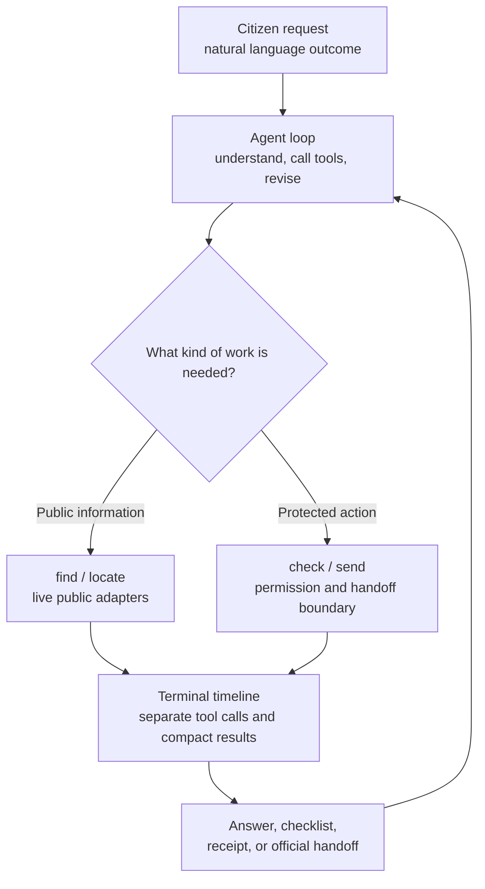
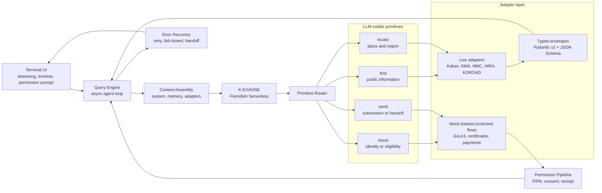

<a href="https://github.com/umyunsang/UMMAYA/blob/main/assets/ummaya-demo.mp4">
  
</a>

<sub>데모를 클릭하면 MP4로 볼 수 있습니다. 이 영상은 실제 `ummaya` 터미널 세션을 `t-rec`으로 녹화한 결과입니다. 긴 대기 구간만 편집했고, 프롬프트, UI, 답변, 도구 호출은 합성하지 않았습니다.</sub>

# UMMAYA

[](https://www.npmjs.com/package/ummaya)
[](LICENSE)

**Unified Multi-Ministry Agent for Your Administration.**
읽으면, **엄마야**.

UMMAYA는 한국 공공서비스를 자연어로 다루기 위한 터미널 AI 하네스입니다. 사용자는 기관명, 포털명, API 이름을 먼저 외우지 않고 원하는 결과를 말합니다. UMMAYA는 FriendliAI로 서빙되는 K-EXAONE이 공공서비스 어댑터를 고르고, `find`, `locate`, `check`, `send` 네 가지 primitive를 순서대로 호출하도록 연결합니다.

```bash
curl -fsSL https://raw.githubusercontent.com/umyunsang/UMMAYA/main/install.sh | bash && ummaya
```

실행 후 `/login`을 입력하고 FriendliAI API 키를 붙여 넣으면 됩니다. 공개 CLI 사용자는 Kakao, data.go.kr, JUSO, SGIS 키를 따로 설정하지 않습니다. 라이브 공공 API 자격 증명은 패키지의 gateway 경로에서 운영자 관리 방식으로 처리합니다.

> UMMAYA는 학술 및 연구개발 목적의 프로젝트입니다. Anthropic, LG AI Research, FriendliAI, 대한민국 정부 또는 특정 공공기관과 공식 제휴된 서비스가 아닙니다.

## 먼저 보는 요약

| 독자가 궁금한 것 | 짧은 답 |
|---|---|
| 무엇인가요? | 한국 행정·공공 인프라를 하나의 터미널 대화창에서 다루기 위한 agentic CLI입니다. |
| 왜 필요한가요? | 시민은 보통 "어느 기관 API를 호출할까"가 아니라 "지금 뭘 해야 하지"라고 생각하기 때문입니다. |
| 지금 어디까지 되나요? | 위치·날씨·응급실·병원·도로안전 같은 공개 정보는 live adapter로 조회하고, 본인확인·신청·납부처럼 보호된 업무는 mock 또는 공식 채널 handoff에서 멈춥니다. |
| 어떤 모델을 쓰나요? | FriendliAI Serverless 위의 `LGAI-EXAONE/K-EXAONE-236B-A23B`를 사용합니다. |
| 사용자가 준비할 키는요? | `/login`에서 넣는 FriendliAI API 키 하나입니다. 공공 API 키는 공개 CLI 사용자에게 요구하지 않습니다. |

## 왜 만들었나

대부분의 디지털 공공서비스는 이미 존재합니다. 문제는 사용자가 그 서비스를 찾고 조합하는 방식입니다. 감기 증상으로 병원을 찾을 때, 이사 후 주소를 바꿀 때, 부모님 동네의 재난 알림을 확인할 때 사용자는 부처명이나 API 스키마를 떠올리지 않습니다.

보통 이렇게 말합니다.

```text
동아대 승학캠퍼스에서 친구가 갑자기 아프면 지금 바로 연락할 응급실 어디가 가까워?
```

또는 이렇게 말합니다.

```text
이사했어. 전입신고하고 자동차, 건강보험, 학교 관련 주소도 한 번에 바꿔줘.
```

UMMAYA의 실험은 여기서 시작합니다. 하나의 대화창이 요청을 이해하고, 필요한 기관 채널을 찾고, 공개 정보는 조회하고, 보호된 업무는 권한 확인과 공식 handoff 경계 안에서 다룹니다. 핵심은 "도구가 많다"가 아니라, 사용자가 말한 목적을 해결하기 위해 도구가 자연스럽게 선택되고 순서가 드러나는 경험입니다.

## 어떤 경험을 목표로 하나

UMMAYA는 Claude Code가 개발자에게 준 경험을 시민 행정 도메인으로 옮기는 실험입니다. 개발자가 `claude "fix the failing test"`라고 말하면 파일 읽기, 수정, 테스트, 재시도가 하나의 loop로 이어지듯이, 시민은 `출산 보조금 신청하고 싶어`라고 말하고 기관 조회, 조건 확인, 서류 준비, 제출 또는 handoff까지 이어지는 흐름을 기대할 수 있어야 합니다.

| Claude Code | UMMAYA |
|---|---|
| 개발자가 코드를 고치기 위해 말합니다 | 시민이 행정 결과를 얻기 위해 말합니다 |
| 파일, 쉘, git, 검색 도구를 호출합니다 | 공공 API, 위치, 인증, 제출, 공식 handoff 채널을 호출합니다 |
| 위험한 명령에는 권한을 묻습니다 | 개인정보, 본인확인, 제출, 납부에는 권한을 묻습니다 |
| 작업 로그와 도구 호출이 터미널에 남습니다 | 조회, 위치 해석, 확인, 제출 흐름이 터미널에 순서대로 남습니다 |

이 관점은 [Platform Vision](https://github.com/umyunsang/UMMAYA/blob/main/docs/vision.md)에 정리되어 있습니다.

## 지금 할 수 있는 일

현재 공개 릴리스는 "국가행정 전체 자동화"가 아니라, 설치 가능한 터미널 하네스와 live/mock adapter 경계를 검증하는 alpha입니다.

| 영역 | 현재 동작 | 사용자에게 보이는 흐름 |
|---|---|---|
| 위치 이해 | Kakao, JUSO, SGIS 기반 `locate` adapter | 장소명, 주소, 행정구역, 좌표를 해석합니다 |
| 공개 정보 조회 | KMA, HIRA, NMC, NFA119, KOROAD, MOHW 계열 `find` adapter | 날씨, 병원, 응급실, 도로안전, 복지 정보를 조회합니다 |
| 본인확인·자격확인 | public-spec 기반 mock `check` adapter | 권한이 필요한 이유를 설명하고 확인 흐름을 시뮬레이션합니다 |
| 신청·납부·제출 | public-spec 기반 mock `send` adapter 또는 official handoff | 실제 제출을 주장하지 않고 receipt, 체크리스트, 공식 경로를 남깁니다 |
| 터미널 UI | 실제 tool timeline, compact result, assistant answer | 도구 호출이 순차적으로 보이고 긴 결과는 축약됩니다 |

공개 정보와 위치 조회는 live API 비중이 높습니다. 본인확인, 증명서, 납부, 민원 제출처럼 법적·개인정보 경계가 있는 업무는 mock 또는 handoff로 제한합니다. 이 제한은 기능 부족을 숨기기 위한 표현이 아니라, 프로젝트가 지키는 안전 경계입니다.

## 이렇게 물어보세요

아래 문장은 기능 나열이 아니라 실제 사용자가 터미널에 그대로 입력할 만한 요청입니다.

| 상황 | 프롬프트 |
|---|---|
| 퇴근길 날씨 | `퇴근하고 다대포해수욕장 걸어가도 괜찮을까? 지금 비 오는지랑 체감상 추운지만 알려줘.` |
| 학교 근처 응급실 | `동아대 승학캠퍼스에서 친구가 갑자기 아프면 지금 바로 연락할 응급실 어디가 가까워? 찾아진 곳만 이름, 주소, 전화번호로 정리해줘.` |
| 동네 병원 찾기 | `다대1동 근처에서 오늘 전화해볼 수 있는 내과가 있을까? 가까운 곳 위주로 주소랑 전화번호를 알려줘.` |
| 도로·날씨 판단 | `비 오는 날 다대포에서 김해공항까지 차로 가야 해. 날씨랑 도로 위험 정보를 같이 보고 조심할 점을 알려줘.` |
| 이사 후 행정 | `이사했어. 전입신고하고 자동차, 건강보험, 학교 관련 주소는 어떤 순서로 확인해야 하는지 알려줘.` |
| 보호된 업무 경계 | `정부기관들이 내 정보를 어디에 쓰고 있는지 확인하고 잘못된 주소나 연락처는 고쳐줘.` |

도구 호출을 보고 싶다면 한 프롬프트에 모든 기능을 억지로 넣을 필요가 없습니다. 자연스러운 질문을 여러 번 던지면, UMMAYA가 필요한 primitive와 adapter를 각 turn에서 선택합니다.

## 빠른 설치

macOS 권장 설치:

```bash
curl -fsSL https://raw.githubusercontent.com/umyunsang/UMMAYA/main/install.sh | bash && ummaya
```

Homebrew로 직접 설치:

```bash
brew tap umyunsang/ummaya && brew install --cask ummaya && ummaya
```

npm 대체 설치:

```bash
npm install -g ummaya && ummaya
```

Homebrew 경로는 패키지 CLI가 쓰는 런타임 의존성을 함께 설치합니다. npm 경로는 Bun `>=1.3.0`과 `uv`가 로컬에 준비되어 있어야 합니다.

## 처음 실행

1. UMMAYA를 실행합니다.

   ```bash
   ummaya
   ```

2. 로그인합니다.

   ```text
   /login
   ```

3. FriendliAI API 키를 붙여 넣습니다.

4. 자연어로 요청합니다.

   ```text
   동아대 승학캠퍼스에서 친구가 갑자기 아프면 지금 바로 연락할 응급실 어디가 가까워?
   ```

세션은 로컬 사용자 영역에 저장됩니다. 이어서 작업하려면 터미널에 표시되는 `ummaya --resume <session-id>` 명령을 사용할 수 있습니다.

## 작동 방식

UMMAYA는 LLM에게 기관별 API 수십 개를 그대로 노출하지 않습니다. 모델이 보는 표면은 네 개의 primitive로 유지하고, 실제 기관별 차이는 adapter layer 뒤로 숨깁니다.



런타임 구조는 여섯 layer로 나뉩니다.



이 구조에서 중요한 점은 세 가지입니다.

- `find`와 `locate`는 현재 데모에서 가장 많이 보이는 live public-service path입니다.
- `check`와 `send`는 보호된 업무를 다루기 때문에 권한, 시뮬레이션, receipt, 공식 handoff가 먼저입니다.
- TUI는 도구 호출을 하나로 뭉개지 않고 순서대로 보여줘야 합니다. 긴 tool result는 축약하고, 자세히 볼 때는 `ctrl+o` 확장 흐름을 따릅니다.

## 안전 경계

UMMAYA는 공식 접근 권한 없이 보호된 정부 업무를 완료한다고 주장하지 않습니다.

| 업무 유형 | 현재 공개 릴리스의 처리 |
|---|---|
| 날씨, 병원, 응급실, 위치, 도로안전 같은 공개 정보 | live adapter로 조회 |
| 본인확인, 증명서, 세금, 납부, 민원 제출 | mock, checklist, receipt, official handoff |
| 개인정보 정정, 기관 간 자동 제출, 결제 실행 | 공식 접근 경로가 없으면 실행하지 않음 |
| API 장애, zero result, 권한 부족 | fail-closed로 멈추고 원인을 설명 |

이 원칙은 [API Catalog](https://github.com/umyunsang/UMMAYA/blob/main/docs/api/README.md)와 [Environment Variable Registry](https://github.com/umyunsang/UMMAYA/blob/main/docs/configuration.md)에 맞춰 유지됩니다.

## 개발자와 파트너를 위해

UMMAYA를 확장하거나 검토할 때는 아래 순서로 보면 빠릅니다.

| 문서 | 역할 |
|---|---|
| [Platform Vision](https://github.com/umyunsang/UMMAYA/blob/main/docs/vision.md) | 왜 Claude Code 스타일 harness를 한국 공공서비스로 옮기는지 설명합니다 |
| [API Catalog](https://github.com/umyunsang/UMMAYA/blob/main/docs/api/README.md) | active adapter, primitive, permission tier, JSON Schema를 확인합니다 |
| [Plugin Docs](https://github.com/umyunsang/UMMAYA/tree/main/docs/plugins) | 외부 시민·기관 contributor가 adapter/plugin을 붙이는 구조를 설명합니다 |
| [Configuration](https://github.com/umyunsang/UMMAYA/blob/main/docs/configuration.md) | 모든 환경변수와 credential ownership을 정리합니다 |
| [Demo Pipeline](https://github.com/umyunsang/UMMAYA/tree/main/docs/demo) | README 데모를 실제 `ummaya` + `t-rec`으로 녹화하는 절차를 남깁니다 |
| [Contributing](https://github.com/umyunsang/UMMAYA/blob/main/CONTRIBUTING.md) | 개발, 테스트, PR workflow를 설명합니다 |

로컬 개발 환경:

```bash
uv sync --frozen --all-extras --dev
cd tui && bun install --frozen-lockfile
```

기본 검증:

```bash
uv run pytest -m "not live"
cd tui && bun run typecheck
```

패키징 검증:

```bash
npm run package:check
```

## 모델과 라이선스

UMMAYA는 현재 LLM 응답에 FriendliAI를 통한 [K-EXAONE-236B-A23B](https://huggingface.co/LGAI-EXAONE/K-EXAONE-236B-A23B)를 사용합니다.

- 모델: `LGAI-EXAONE/K-EXAONE-236B-A23B`
- 추론 채널: `UMMAYA_K_EXAONE_THINKING` default `false`
- 모델 라이선스: [K-EXAONE AI Model License Agreement](https://huggingface.co/LGAI-EXAONE/K-EXAONE-236B-A23B/blob/main/LICENSE)
- 프로젝트 라이선스: [Apache License 2.0](LICENSE)

모델 라이선스는 UMMAYA 소스코드 라이선스와 별개입니다. UMMAYA는 LG AI Research, FriendliAI, Hugging Face, 대한민국 정부 또는 공공기관 자산에 대한 권리를 부여하지 않습니다.

## 상태

UMMAYA는 alpha 단계의 학생 포트폴리오이자 학술 R&D 프로젝트입니다. 현재 목표는 완성된 정부 자동화 서비스가 아니라, 공공서비스를 LLM tool loop로 안전하게 다루는 harness 구조를 실제 설치, 실제 터미널, 실제 live adapter, 검증 가능한 mock/handoff 경계로 증명하는 것입니다.

이슈, 시나리오 아이디어, 문서 개선, 어댑터 제안은 [GitHub Issues](https://github.com/umyunsang/UMMAYA/issues)와 [Discussions](https://github.com/umyunsang/UMMAYA/discussions)에서 받을 수 있습니다.
