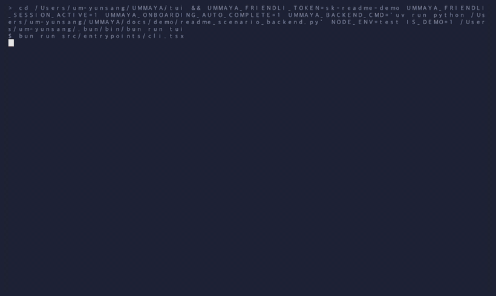
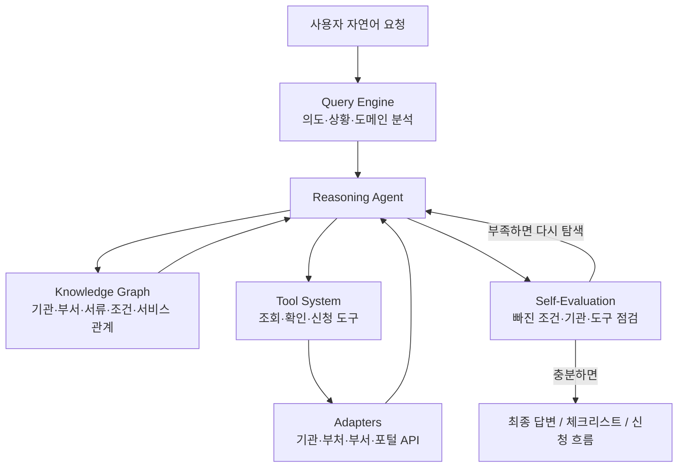

# UMMAYA

**U**nified **M**ulti-**M**inistry **A**gent for **Y**our **A**dministration  
읽으면, **엄마야**.

> **대한민국 공공서비스를 자연어로 다루기 위한 국가 AX 하네스**  
> 사용자의 한 문장을 Query Engine이 의도로 분석하고, Reasoning Agent가 Agentic RAG 방식으로 필요한 공공 도메인과 도구를 찾고, 도구시스템이 AI의 손과 발이 되어 조회·확인·신청 흐름을 실행합니다.

```bash
curl -fsSL https://raw.githubusercontent.com/umyunsang/UMMAYA/main/install.sh | bash
```

또는

```bash
brew tap umyunsang/ummaya
brew install --cask ummaya
```

> 학술·연구개발 목적의 프로젝트입니다. Anthropic, LG AI Research, FriendliAI, 대한민국 정부 또는 특정 공공기관과 공식 제휴된 서비스가 아닙니다.



<sub>README 데모는 실제 `ummaya` 터미널 세션을 실행하고, 라이브 LLM이 공공 API 도구를 선택하는 흐름을 `t-rec`으로 기록합니다. 재생성: `npm run demo:readme`</sub>

---

## 엄마야, 이거 뭐부터 해야 해?

어릴 때 우리 엄마는 초능력자 같았습니다.

내가 찾을 땐 없던 체육복,  
분명히 봤는데 사라진 양말,  
내일 가져가야 하는 준비물,  
오늘까지 내야 하는 서류.

나는 아무리 찾아도 못 찾는데, 엄마는 늘 한마디로 끝냈습니다.

> “빨래통 봤어?”  
> “두 번째 서랍 열어봐.”  
> “그거 오늘까지 해야 하는 거 아니야?”  
> “찾아서 나오면 어떡할래?”

그리고 진짜 나왔습니다.

그때는 몰랐습니다. 엄마가 대단했던 건 단순히 물건을 잘 찾는 능력이 아니라, **집안의 모든 흐름을 알고 있었다는 것**이었습니다. 빨래가 어디까지 됐는지, 청소는 어디가 남았는지, 설거지는 얼마나 쌓였는지, 내가 뭘 놓쳤는지, 오늘까지 해야 할 일이 무엇인지까지 알고 있었습니다.

어른이 되면 우리가 못 찾는 것도 달라집니다.

전입신고는 어디서 해야 할까?  
자동차 주소 변경도 따로 해야 할까?  
건강보험, 세금, 지원금, 증명서는 어떻게 확인해야 할까?  
이 일은 어느 기관, 어느 부서, 어느 포털, 어떤 서류부터 시작해야 할까?

그래서 만들었습니다.

**UMMAYA.**  
읽으면, **엄마야**.

어릴 때 엄마가 집안의 흐름을 알고 있었듯, UMMAYA는 AI가 공공서비스의 흐름을 이해하고 사용할 수 있게 만드는 **하네스**입니다.

---

## UMMAYA는 무엇인가요?

UMMAYA는 흩어진 기관·부처·부서·포털의 공공서비스를 LLM이 사용할 수 있게 연결하는 **국가 AX 하네스**입니다.

공공서비스는 이미 디지털화되어 있습니다. 하지만 사용자 입장에서는 여전히 하나로 연결되어 있지 않습니다. 이사 하나에도 전입, 차량, 건강보험, 학교, 지자체 민원이 갈라지고, 출산 하나에도 신고, 가족관계, 건강보험, 수당, 지자체 지원금이 나뉩니다.

기존 방식에서는 사용자가 직접 사이트를 찾고, 기관명을 추측하고, 로그인하고, 메뉴를 뒤지고, 조회와 신청 버튼을 눌러야 했습니다. AI에게 물어도 많은 경우 “어느 사이트에서 하세요”라는 안내에서 멈춥니다.

UMMAYA는 그 방식을 바꾸려 합니다.

사용자는 자연어로 말합니다.

```text
이사했어. 전입신고하고 자동차, 건강보험, 학교 관련 주소도 뭐부터 확인해야 하는지 알려줘.
```

UMMAYA는 이 문장을 단순 검색어로 보지 않습니다. Query Engine이 사용자의 상황과 의도를 분석하고, Reasoning Agent가 관련 공공 도메인을 찾고, Agentic RAG 루프를 통해 필요한 지식과 도구를 오가며 확인합니다. 도구시스템은 AI의 손과 발이 되어 국가 인프라의 조회·확인·신청 흐름을 사용할 수 있게 합니다.

---

## 한 줄로 말하면

> **UMMAYA는 공공서비스를 설명하는 챗봇이 아니라, LLM이 공공서비스를 이해하고 사용할 수 있게 만드는 국가 AX 하네스입니다.**

조금 더 풀어 말하면:

- 사용자의 자연어 요청을 공공서비스 실행 의도로 바꿉니다.
- Reasoning Agent가 지식그래프와 도구 결과를 오가며 필요한 기관과 절차를 찾습니다.
- 흩어진 공공 도메인을 조회·확인·신청 도구로 감싸 AI가 사용할 수 있게 합니다.
- 기존 기관·부처·부서·포털 시스템은 바꾸지 않고, 그 위에 AI 실행 계층을 얹습니다.
- 본인확인, 개인정보, 납부, 공식 제출처럼 신뢰가 필요한 지점은 공식 채널과 사용자 확인을 우선합니다.

---

## 핵심 아키텍처

UMMAYA의 핵심은 하나의 모델도, 하나의 API도, 단순한 도구 목록도 아닙니다.  
핵심은 **LLM이 공공서비스를 분석하고, 추론하고, 필요한 도구를 찾아 사용할 수 있게 하는 하네스 구조**입니다.



### 1. Query Engine

Query Engine은 사용자의 말을 단순 검색어가 아니라 **의도와 상황이 담긴 공공서비스 요청**으로 분석합니다.

예를 들어 아래 문장은 하나의 키워드 검색이 아닙니다.

```text
아기가 태어났어. 신고랑 지원금 챙겨줘.
```

이 요청에는 출생신고, 가족관계, 건강보험, 아동수당, 부모급여, 지자체 지원금, 거주지 조건, 신청 가능 여부가 함께 들어 있습니다.

Query Engine은 다음을 파악합니다.

- 사용자가 어떤 생활 사건을 말하고 있는가
- 어떤 기관, 부서, 포털, 제도가 관련될 수 있는가
- 조회가 필요한가, 확인이 필요한가, 신청 흐름이 필요한가
- 지역, 자격, 기한, 서류, 본인확인 같은 조건이 있는가
- 다음 Reasoning Agent가 어떤 도메인부터 탐색해야 하는가

### 2. Agentic RAG

UMMAYA는 문서 하나를 검색하고 답하는 일반 RAG가 아닙니다.

사용자 요청이 들어오면 Reasoning Agent가 지식그래프와 도구 결과를 오가며 스스로 판단합니다. 필요한 기관을 찾고, 관련 조건을 확인하고, 도구를 호출하고, 결과를 다시 평가합니다. 부족하면 다시 탐색합니다.

흐름은 다음과 같습니다.

```text
Query
→ Reasoning Agent
→ Knowledge Graph + Tools
→ Self-Evaluation
→ 필요한 경우 재탐색
→ Final Answer / Action Flow
```

공공서비스에는 단일 정답보다 관계가 중요합니다. 지역, 자격, 서류, 기관, 포털, 인증, 신청 가능 여부, 후속 업무가 서로 연결되어 있기 때문입니다.

UMMAYA의 Agentic RAG는 이 관계망 위에서 “다음에 무엇을 확인해야 하는가”를 계속 판단합니다.

### 3. Tool System

도구시스템은 하네스 안에서 **LLM의 손과 발** 역할을 합니다.

모델이 공공서비스를 이해하기만 해서는 충분하지 않습니다. 실제로 국가 인프라를 사용할 수 있어야 합니다. 그래서 UMMAYA는 기관·부처·부서·포털의 API와 서비스 도메인을 AI가 사용할 수 있는 도구로 감쌉니다.

도구의 중심은 세 가지입니다.

- **조회**: 필요한 공공서비스, 기관, 제도, 상태, 공개 정보를 찾습니다.
- **확인**: 지역, 자격, 서류, 기한, 수수료, 후속 조치처럼 놓치기 쉬운 조건을 점검합니다.
- **신청**: 공식 신청으로 이어지는 흐름을 구성하고, 필요한 경우 공식 채널 또는 승인된 연동으로 연결합니다.

중요한 점은 기존 공공 도메인을 바꾸지 않는다는 것입니다. 기관 시스템은 그대로 두고, 그 위에 LLM이 사용할 수 있는 실행 하네스를 얹습니다.

---

## UMMAYA가 만들고 싶은 경험

### 이사

사용자는 이렇게 말합니다.

```text
이사했어. 전입신고, 자동차, 건강보험, 학교 주소 변경까지 뭐부터 해야 하는지 알려줘.
```

UMMAYA는 전입, 차량, 건강보험, 교육, 지자체 민원처럼 흩어진 도메인을 하나의 생활 사건으로 묶어 봅니다. 어떤 서비스를 조회해야 하는지, 어떤 조건을 확인해야 하는지, 어떤 신청 흐름으로 이어질 수 있는지 정리합니다.

### 출산

```text
아기가 태어났어. 신고랑 받을 수 있는 지원금 챙겨줘.
```

출생신고, 가족관계, 건강보험, 아동수당, 부모급여, 지자체 출산지원금처럼 여러 도메인을 연결합니다. 사용자는 포털명을 외우지 않아도 됩니다. 해야 할 일을 자연어로 말하면 됩니다.

### 복지

```text
내가 받을 수 있는 복지 지원금 확인하고 신청 도와줘.
```

UMMAYA는 사용자의 상황을 바탕으로 관련 복지 도메인을 찾고, 지역·가구·연령·소득·서류 조건을 확인해야 하는 흐름으로 나눕니다. 공식 신청이 필요한 경우에는 사용자가 확인해야 할 지점을 분명히 구분합니다.

### 전세 계약

```text
전세 계약했어. 확정일자, 임대차 신고, 보증 관련해서 놓치면 위험한 부분을 체크해줘.
```

확정일자, 임대차 신고, 보증, 위험 확인, 기한 같은 요소를 함께 살핍니다. 단순 안내가 아니라 사용자가 놓치기 쉬운 확인 흐름을 정리합니다.

---

## 빠른 시작

### 1. 설치하기

권장 설치:

```bash
curl -fsSL https://raw.githubusercontent.com/umyunsang/UMMAYA/main/install.sh | bash
ummaya
```

Homebrew cask로 직접 설치:

```bash
brew tap umyunsang/ummaya
brew install --cask ummaya
ummaya
```

npm으로 설치:

```bash
npm install -g ummaya
ummaya
```

실행 참고:

- `UMMAYA_K_EXAONE_THINKING` default `true`: K-EXAONE의 분리된 reasoning 채널을 사용합니다. 응답/도구 페인팅 지연을 분리해서 진단할 때만 `false`로 낮춥니다.

### 2. AI 요청을 위한 로그인

UMMAYA는 LLM 응답에 **K-EXAONE-236B-A23B** 모델을 사용하며, 요청을 보내려면 **FriendliAI API 키**가 필요합니다.

릴리즈 패키지 사용자는 Kakao, data.go.kr, JUSO, SGIS 키를 따로 설정하지 않습니다. 라이브 공공 API 어댑터는 운영자가 관리하는 게이트웨이를 통해 호출됩니다.

UMMAYA를 실행한 뒤 아래 명령어를 입력합니다.

```text
/login
```

### 3. 자연어로 물어보기

먼저 포털을 찾고, 기관을 찾고, 서류명을 검색하지 않아도 됩니다. 해야 할 일을 평소 말하듯 입력하세요.

```text
이사했어. 전입신고하고 자동차, 건강보험, 학교 관련 주소도 뭐부터 확인해야 하는지 알려줘.
```

---

## 이렇게 물어볼 수 있어요

| 상황 | UMMAYA에게 이렇게 물어보세요 |
|---|---|
| 이사 | “이사했어. 전입신고, 자동차 주소 변경, 건강보험, 학교 주소 변경까지 뭐부터 해야 하는지 알려줘.” |
| 세금·환급 | “작년 종합소득세 신고를 확인하고 환급받을 수 있는지, 필요한 절차를 알려줘.” |
| 세금·과태료 | “이번 달 재산세, 자동차세, 과태료가 있는지 확인하려면 어디서 무엇을 봐야 해?” |
| 출산 | “아기가 태어났어. 출생신고, 아동수당, 첫만남이용권, 건강보험 피부양자 등록 절차를 순서대로 알려줘.” |
| 전세 계약 | “전세 계약했어. 확정일자, 임대차 신고, 전세보증 관련해서 놓치면 위험한 부분을 체크해줘.” |
| 창업 | “카페 창업하려고 해. 사업자등록, 영업신고, 위생교육, 카드가맹, 세금 준비를 순서대로 알려줘.” |
| 야간진료 | “아이가 밤에 열이 높아. 지금 확인해야 할 응급실, 야간진료, 보험 관련 정보를 정리해줘.” |
| 재난 피해 | “집이 침수됐어. 피해 신고, 재난지원금, 임시주거, 전기·가스 안전 점검을 뭐부터 해야 해?” |
| 개인정보 | “공공기관에 등록된 내 주소나 연락처가 잘못됐을 때 어디서 어떻게 확인하고 고쳐야 해?” |

---

## UMMAYA가 아닌 것

UMMAYA는 단순히 친절한 챗봇이 아닙니다.  
공공 API 목록을 모아둔 카탈로그도 아닙니다.  
새로운 정부 포털을 하나 더 만들려는 프로젝트도 아닙니다.

UMMAYA는 기존 공공 도메인을 유지한 채, LLM이 그 도메인을 이해하고 사용할 수 있도록 만드는 **실행 하네스**입니다.

사람이 직접 포털을 오가며 하던 일을 AI가 이해 가능한 구조로 바꾸고, 국가 인프라를 조회·확인·신청 도구로 사용할 수 있게 만드는 것이 목표입니다.

---

## 현재 릴리스에서 가능한 것과 경계

UMMAYA는 국가 인프라를 무단으로 자동 처리한다고 주장하지 않습니다.

현재 공개 릴리스는 설치 가능한 CLI와 공공서비스 조회·확인 중심의 하네스 경험에 초점을 맞추고 있습니다. 공개 접근이 가능한 정보, 운영자 관리 자격 증명 또는 공개 채널을 통해 호출 가능한 서비스는 실제 조회 흐름으로 다룹니다.

반면 정부24, 마이데이터, 간편인증, 증명서 발급, 납부, 공식 제출, 복지 신청, 공과금 변경처럼 기관 승인과 보안 검토가 필요한 보호 업무는 공식 접근 권한 없이는 실제 기관 시스템에 접근하지 않습니다. 이런 영역은 안전한 도메인 시뮬레이션 또는 공식 채널 안내로 표현됩니다.

이 경계는 한계이면서 동시에 설계 원칙입니다.

UMMAYA는 비공식 접근, 인증 우회, 내부 시스템 스크래핑을 목표로 하지 않습니다. 공공기관, 인프라 운영자, civic-tech 파트너가 함께 실제 연동으로 전환할 수 있는 하네스 구조를 검증하는 데 초점을 둡니다.

---

## 개발자와 공공기관을 위한 관점

UMMAYA에서 중요한 것은 “API를 몇 개 붙였는가”가 아니라 **LLM이 공공서비스를 사용할 수 있는 구조를 어떻게 만들었는가**입니다.

개발자는 다음 관점에서 프로젝트를 볼 수 있습니다.

- 자연어 요청을 공공서비스 실행 의도로 변환하는 Query Engine
- 지식그래프와 도구 결과를 오가며 스스로 점검하는 Agentic RAG
- 공공 도메인을 조회·확인·신청 도구로 감싸는 Tool System
- 기관별 복잡도를 흡수하는 adapter 구조
- 공식 연동 전 시민 여정을 검증할 수 있는 도메인 시뮬레이션

공공기관과 파트너는 UMMAYA를 통해 시민이 실제로 어떤 표현으로 서비스를 요청하는지, 어떤 지점에서 기관 경계가 끊기는지, 어떤 도메인을 AI 도구로 감싸야 하는지 검토할 수 있습니다.

---

## 모델과 라이선스

UMMAYA는 현재 LLM 응답에 [K-EXAONE-236B-A23B](https://huggingface.co/LGAI-EXAONE/K-EXAONE-236B-A23B) 모델을 사용합니다.

- **모델:** `LGAI-EXAONE/K-EXAONE-236B-A23B`
- **모델 라이선스:** [`K-EXAONE AI Model License Agreement`](https://huggingface.co/LGAI-EXAONE/K-EXAONE-236B-A23B/blob/main/LICENSE) (`k-exaone`)
- **프로젝트 라이선스:** [Apache License 2.0](LICENSE)

모델 라이선스는 UMMAYA 소스코드 라이선스와 별개입니다. 모델을 다운로드, 서빙, 수정, 재배포하거나 상업적으로 제공하려면 K-EXAONE 라이선스를 확인하고 준수해야 합니다.

UMMAYA는 LG AI Research, FriendliAI, Hugging Face 또는 정부기관 자산에 대한 권리를 부여하지 않습니다.

---

## 현재 릴리스

현재 공개 릴리스는 설치 가능한 CLI에 초점을 맞추고 있습니다.

- npm package: `ummaya`
- Homebrew cask: `ummaya`

UMMAYA는 학생 포트폴리오이자 학술 R&D 프로젝트입니다. 실제 공공서비스 업무는 공식 제공 여부와 접근 정책에 따라 안내, 공식 채널 연결, 또는 도메인 시뮬레이션으로 끝날 수 있습니다.

---

## 더 알아보기

- [`CHANGELOG.md`](CHANGELOG.md) - 릴리스 변경 내역
- [`SECURITY.md`](SECURITY.md) - 보안 취약점 제보 방법
- [`CONTRIBUTING.md`](CONTRIBUTING.md) - 기여 가이드
- Wiki - 연구 노트와 프로젝트 배경 설명

---

## 기여하기

이슈, 토론, 시나리오 아이디어, 버그 리포트, 문서 개선 제안을 환영합니다.

큰 변경을 시작하기 전에는 [`CONTRIBUTING.md`](CONTRIBUTING.md)를 먼저 확인하고, [Discussion](https://github.com/umyunsang/UMMAYA/discussions)을 통해 방향을 공유해 주세요.

---

## 라이선스

이 프로젝트는 [Apache License 2.0](LICENSE)에 따라 배포됩니다.
