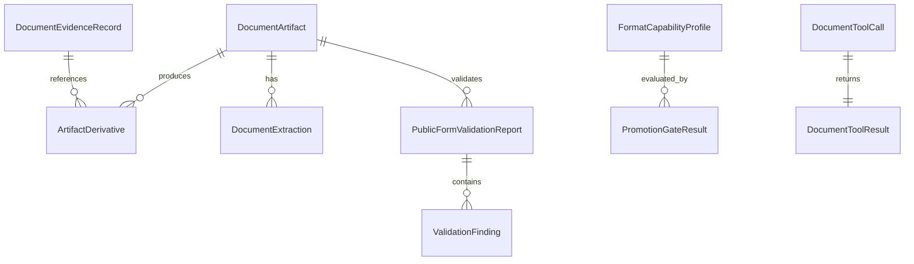

# Data Model: Public AX Document Harness

## Entity Overview



## `DocumentFormat`

Supported values:

- `hwpx`
- `hwp`
- `docx`
- `pdf`
- `xlsx`
- `pptx`

Rules:

- Extension, signature/container, and detected structure must agree.
- Unsupported or mismatched files return a blocked result before parsing.
- Binary HWP has no write capability in this epic.

## `DocumentArtifact`

Represents a user-provided source file or a generated derivative.

Fields:

- `artifact_id`: stable opaque ID.
- `session_id`: UMMAYA session identifier.
- `source_path`: canonical absolute path for local sources or artifact-store path for derivatives.
- `display_name`: sanitized user-facing filename.
- `format`: `DocumentFormat`.
- `mime_type`: detected MIME/container type.
- `sha256`: checksum of the artifact bytes.
- `byte_size`: raw byte size.
- `expanded_byte_size`: decompressed package size for archive formats.
- `page_count`: PDF/page-like count when known.
- `sheet_count`: XLSX sheet count when known.
- `slide_count`: PPTX slide count when known.
- `section_count`: HWPX/HWP section count when known.
- `created_at`: UTC timestamp.
- `lineage`: `source`, `working_copy`, `render`, `validation_report`, or `export`.
- `parent_artifact_id`: source artifact ID for derivatives.
- `security_state`: `accepted`, `blocked`, or `needs_manual_review`.
- `blocked_reason`: machine-readable reason when blocked.

Validation rules:

- `source_path` must resolve inside the artifact store for derivatives.
- User originals are never overwritten.
- Hidden filenames, traversal segments, and public-root destinations are rejected.

## `DocumentIntakePolicy`

Defines fail-closed pre-parse rules.

Fields:

- `allowed_formats`: set of `DocumentFormat`.
- `max_raw_bytes`: maximum raw file bytes.
- `max_expanded_bytes`: maximum decompressed package bytes.
- `max_entries`: maximum package entry count.
- `max_depth`: maximum nested archive/package depth.
- `max_pages`, `max_sheets`, `max_slides`: bounded parse limits.
- `allow_external_links`: false by default.
- `allow_macros`: false.
- `allow_embedded_active_content`: false.
- `storage_root`: canonical artifact root.

Validation rules:

- Content type is a hint only; extension and signature/container checks must pass.
- ZIP-family package entries must not escape the extraction root.
- Rejected files produce `DocumentSecurityFinding` records.

## `FormatCapabilityProfile`

Represents observed support for one format/engine pair.

Fields:

- `profile_id`: stable ID.
- `format`: `DocumentFormat`.
- `engine_name`: library or adapter name.
- `engine_version`: resolved package/version string.
- `license`: SPDX-like license identifier or `unknown`.
- `runtime`: `python`, `external_cli`, `node_bridge`, `rust_bridge`, or `manual_reference`.
- `supports_read`: boolean.
- `supports_extract`: boolean.
- `supports_write`: boolean.
- `supports_style`: boolean.
- `supports_render`: boolean.
- `supports_validation`: boolean.
- `blocked_operations`: list of operation IDs.
- `known_limitations`: list of limitation IDs.
- `fixture_results`: list of fixture evaluation IDs.
- `last_evaluated_at`: UTC timestamp.

Validation rules:

- A capability flag cannot be true unless a passing `PromotionGateResult` exists for that capability.
- HWP `supports_write` must be false for this epic.

## `PromotionGateResult`

Scorecard result controlling model-visible capabilities.

Fields:

- `gate_id`: stable ID.
- `profile_id`: related `FormatCapabilityProfile`.
- `capability`: `read`, `extract`, `write`, `style`, `render`, or `validate`.
- `score_total`: 0 to 100.
- `extraction_fidelity`: 0 to 20.
- `write_fidelity`: 0 to 20.
- `style_layout_control`: 0 to 15.
- `deterministic_round_trip`: 0 to 15.
- `public_form_validation`: 0 to 15.
- `security_privacy`: 0 to 10.
- `license_maintenance_tool_usability`: 0 to 5.
- `hard_gates_passed`: boolean.
- `hard_gate_failures`: list of failure codes.
- `promotion_state`: `blocked`, `read_only`, `write_enabled`, or `style_enabled`.
- `evidence_record_ids`: evidence references.

Validation rules:

- Write promotion requires `score_total >= 85` and `hard_gates_passed = true`.
- Read-only promotion requires `score_total >= 75` and all security gates passed.
- A critical security finding forces `promotion_state = blocked`.

## `DocumentExtraction`

Normalized document content used by LLM and validators.

Fields:

- `artifact_id`: source artifact ID.
- `paragraphs`: ordered `ParagraphBlock` list.
- `tables`: ordered `TableBlock` list.
- `images`: ordered `ImageReference` list.
- `fields`: ordered `FormField` list.
- `metadata`: `DocumentMetadata`.
- `style_map`: `StyleDescriptor` list.
- `warnings`: extraction warnings.

Validation rules:

- Extraction must retain stable block IDs.
- Tables must preserve row/column coordinates and merged-cell spans.
- Field values must preserve source coordinates or format-native paths.

## `FormField`

Represents a fillable or inferred public-form field.

Fields:

- `field_id`: stable ID.
- `label`: visible or inferred label.
- `path`: format-native path, XPath, cell coordinate, field name, or slide shape ID.
- `field_type`: `text`, `number`, `date`, `choice`, `checkbox`, `signature`, `attachment`, or `unknown`.
- `required`: boolean.
- `current_value`: typed scalar value.
- `allowed_values`: list of typed scalar values.
- `style_constraints`: optional style constraints.
- `source_confidence`: 0.0 to 1.0.

Validation rules:

- Required fields missing after fill produce validation findings.
- Unknown fields can be reported but cannot be auto-filled without explicit target mapping.

## `DocumentPatch`

Represents a requested write operation.

Fields:

- `patch_id`: stable ID.
- `target_artifact_id`: source or working copy.
- `operations`: ordered list of `DocumentPatchOperation`.
- `dry_run`: boolean.
- `expected_format`: `DocumentFormat`.
- `destination_policy`: `working_copy`, `export`, or `validation_only`.

Operation types:

- `set_field_value`
- `set_table_cell`
- `replace_text`
- `insert_paragraph`
- `set_paragraph_style`
- `set_run_style`
- `set_cell_style`
- `set_document_metadata`
- `copy_for_edit`

Validation rules:

- Operations are applied only to working copies.
- Unsupported operations return structured blocked results.
- All applied operations must be re-read and compared against intent.

## `StyleDescriptor`

Typed style representation shared by format adapters.

Fields:

- `style_id`: stable ID.
- `target_path`: block, run, cell, field, or shape path.
- `font_family`: optional string.
- `font_size_pt`: optional positive decimal.
- `bold`: optional boolean.
- `italic`: optional boolean.
- `underline`: optional boolean.
- `font_color_rgb`: optional six-hex string.
- `fill_color_rgb`: optional six-hex string.
- `alignment`: `left`, `center`, `right`, `justify`, or `distributed`.
- `line_spacing`: optional decimal.
- `border`: optional `BorderDescriptor`.
- `number_format`: optional string for XLSX.

Validation rules:

- Format adapters must record unsupported style attributes rather than silently ignoring them.
- Font/style changes must be verified through round-trip extraction and render evidence when write-promoted.

## `PublicFormValidationReport`

Represents public-form conformance checks.

Fields:

- `report_id`: stable ID.
- `artifact_id`: validated artifact.
- `template_id`: fixture/template identifier.
- `schema_id`: expected form schema identifier.
- `paragraph_block_f1`: decimal 0.0 to 1.0.
- `table_cell_f1`: decimal 0.0 to 1.0.
- `image_reference_f1`: decimal 0.0 to 1.0.
- `metadata_exact_match`: decimal 0.0 to 1.0.
- `aggregate_score`: decimal 0.0 to 1.0.
- `round_trip_passed`: boolean.
- `render_passed`: boolean.
- `security_passed`: boolean.
- `findings`: list of `ValidationFinding`.
- `decision`: `pass`, `fail`, `blocked`, or `needs_manual_review`.

Validation rules:

- Public-form conformance requires `aggregate_score >= 0.85`.
- A failed security check forces `decision = blocked`.
- A render mismatch forces `decision = fail` unless the capability is read-only.

## `DocumentToolCall`

Tool-loop input envelope.

Fields:

- `tool_id`: concrete tool name.
- `primitive`: `find`, `check`, or `send`.
- `correlation_id`: tool/evidence join key.
- `request`: strict request model selected by `tool_id`.
- `permission_state`: `not_required`, `requested`, `approved`, or `denied`.

Validation rules:

- Write/save tools require permission flow before mutation.
- All tool calls must be joinable to evidence by `correlation_id`.

## `DocumentToolResult`

Tool-loop output envelope.

Fields:

- `tool_id`: concrete tool name.
- `correlation_id`: tool/evidence join key.
- `status`: `ok`, `blocked`, `failed`, or `needs_input`.
- `artifact_refs`: derivative or source references.
- `extraction`: optional `DocumentExtraction`.
- `validation_report`: optional `PublicFormValidationReport`.
- `promotion_gate_result`: optional `PromotionGateResult`.
- `findings`: security/validation findings.
- `text_summary`: short model-readable summary.

Validation rules:

- Structured result must validate against generated JSON Schema.
- A blocked result must include a machine-readable `blocked_reason`.

## State Transitions

```text
source_received
  -> intake_accepted
  -> inspected
  -> copied_for_edit
  -> patched
  -> rendered
  -> validated
  -> ready_for_export

source_received
  -> intake_blocked

patched
  -> validation_failed

any_state
  -> blocked_by_capability
```

No transition mutates the original source artifact.
